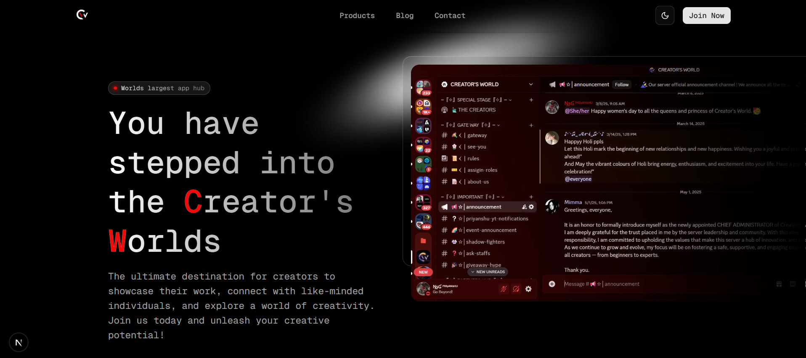

# Legacy Version 
 
>[!ERROR]
> New version is under deployment! 

# Creator's World

 

<!--  -->

## About Creator's World

**Creator's World** is the dynamic, official hub for a global community of creators—artists, developers, writers, and visionaries—who come together to collaborate, inspire, and innovate. This responsive, state-of-the-art website, crafted with modern web technologies, serves as the central platform for community updates, resources, and creative exchange. Whether you're here to join a vibrant creator network or explore an open-source template for your own project, Creator's World empowers you to unleash your creative potential.

> [!IMPORTANT]  
> This is the official website of Creator's World, proudly open-source and available as a customizable template. We invite you to fork and adapt it to bring your unique community vision to life.

## Why Creator's World?

- **Thriving Community**: A safe, inclusive space where creators of all kinds connect, share ideas, and grow together.
- **Engaging Tools**: Powered by interactive Discord apps (formerly bots) to elevate your community experience.
- **Open-Source Core**: A developer-friendly codebase, ideal for customization and community-driven development.

## Get Involved

Dive into the Creator's World community on [Discord](https://discord.gg/7SAcEv7MDd) to connect with creators, share your work, and stay updated on events and resources. Visit our live site at  (replace with your deployed URL) to explore the heart of our creative ecosystem.

Want to create your own community platform? Fork this repository on [GitHub](https://github.com/nsgpriyanshu/creatorsworld) and tailor it to your vision.

## Acknowledgments

We extend our heartfelt gratitude to the exceptional tools and libraries that form the backbone of Creator's World, enabling us to deliver a high-quality, user-centric platform:

- **[Next.js](https://nextjs.org/)**: The cornerstone of our website, Next.js provides a robust React framework that ensures blazing-fast performance, seamless server-side rendering, and scalability. Its developer-friendly ecosystem has been instrumental in creating a responsive and dynamic platform for our community.
- **[ShadCN UI](https://ui.shadcn.com/)**: This elegant component library has transformed our interface with accessible, customizable, and beautifully designed UI elements. ShadCN UI’s focus on simplicity and consistency has elevated the user experience, making navigation intuitive and visually appealing.
- **[Magic UI](https://magicui.design/)**: With its innovative and creative components, Magic UI has added a layer of sophistication and interactivity to our website. These components have helped us craft a unique, engaging experience that resonates with our creative community.
- **Open-Source Community**: A special thank you to the countless developers and contributors in the open-source ecosystem whose tools, libraries, and inspiration have shaped Creator's World into what it is today.

## Future Vision

Creator's World is just the beginning. Our roadmap includes:

- Multilingual support to welcome creators from around the globe.
- Advanced creator-focused tools and integrations for deeper engagement.
- Enhanced SEO and performance optimizations for a smoother experience.
- Expanded resources to empower our community and developers alike.

## Contact

Have ideas or questions? Join our [Discord community](https://discord.gg/7SAcEv7MDd) or reach out via [GitHub issues](https://github.com/nsgpriyanshu/creatorsworld/issues) to connect with us.

## Thank You

Thank you for being part of Creator's World! We’re excited to see you in our community, where creativity knows no limits.

  
   
  

