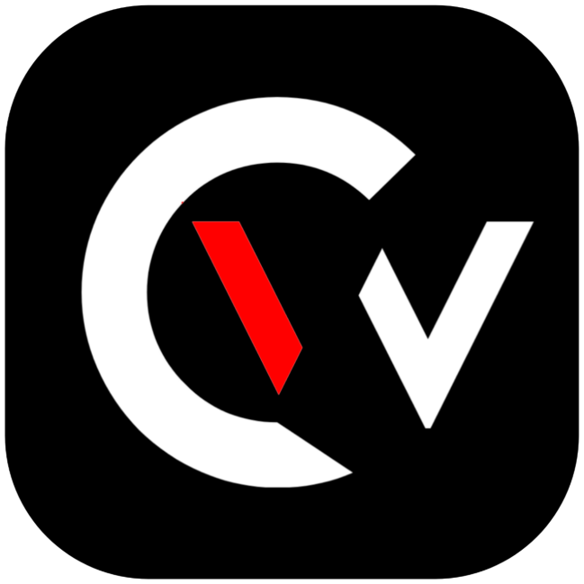

# CREATOR'S WORLD

 

## About

Welcome to the official website of Creator's World! This website serves as the central hub for all information, updates, and resources related to our server.

> [!IMPORTANT]
> DISCLAIMER: This is the official website of Creator's World. However, our website is open source. If you want to create a website like ours, you can use it as a template. We highly recommend using it as a template only.

## Features

- Our server is a friendly and safe community.
- Our server has various Discord apps previously known as bots.
- Our server is a hub for creators, where creators of all types can share their insights through us.

## Acknowledgement

- I would like to acknowledge the incredible framework Next.js for its invaluable contribution to the development of this project. Next.js provided the foundation upon which we built our website, enabling us to create fast, scalable, and efficient web applications. For more information about Next.js, please visit [Next.js website](https://nextjs.org/).
- I would like to acknowledge the amazing component library [ShadCN UI](https://ui.shadcn.com/) for its elegant and accessible UI elements that greatly enhanced the design and usability of this project. ShadCN UI empowered us to build a modern, responsive, and consistent interface with ease. For more information, please visit the [ShadCN UI website](https://ui.shadcn.com/).
- Lastly, I would like to acknowledge [Magic UI](https://magicui.design/) for their magical components that have also played a crucial role in enhancing our website. I encourage you to explore Magic UI for its innovative design solutions.

## Contributors

## Thank You

- I hope we will see you in our server